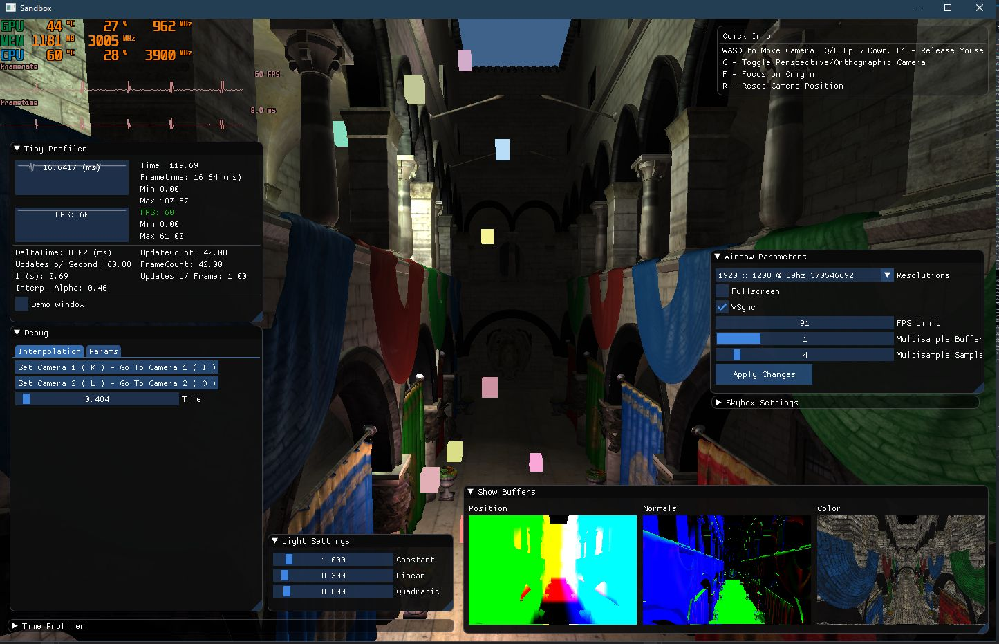
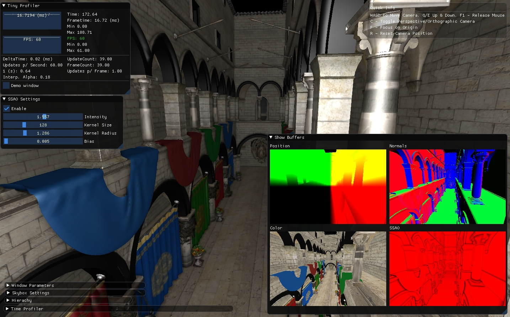
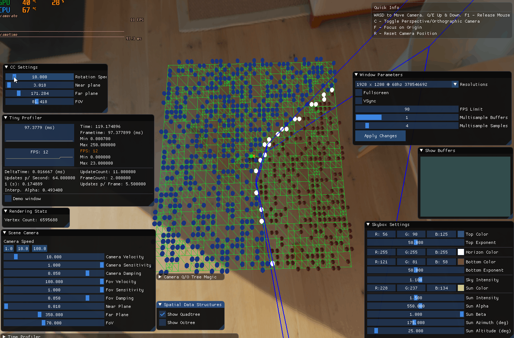

# Modern OpenGL Sandbox

This is a simple sandbox that I've built upon reading a few different tutorials. It's purpose is purely educational. I research topics I find interesting and implement them here. These topics range from general game development best practices, data structure optimization, serialization, multi-threading, custom game-loops, rendering techniques, and any other I find interesting.

Do not expect optimized or neatly structured code here. I focus first on functional implementation, then making it efficient. The later becomes less important when my curiosity leads me to a new topic.

---
## Images

---
## Things Implemented
- [x] Modern OpenGL rendering pipeline
- [x] Deferred Rendering, Render to Texture, Shadow Mapping, Image based Lighting, Point/Directional Lights, Reflection Cubemaps...
- [x] Post Processing: Bloom, SSAO
- [x] Asynchronous texture loading across multiple threads ( producer / consumer )
- [x] ImGUI Integration
- [x] LivePP Integration ( Trial over now )
- [x] Quadtree / Octrees Implementation
- [x] Frustum Culling ( with and without Octrees )
- [x] Simple Settings Serialization
- [x] Simple Editor Inspector ( Transform )
- [x] Material Definition and Serialization
- [x] Assimp Model/Material Loading

## Things Planned, Started or Unfinished
- [ ] Scene Graph
- [ ] Material Definitions, Async Loading
- [ ] Occlusion and Portal Culling
- [ ] Simple Profiler ( w/ ImGUI Display )
- [ ] Entity Components and Serialization
- [ ] Water caustics
- [ ] Others stuff I'll remember later
- [ ] Asset Browser ( Data Folder )

## Dependencies
- [SDL2 v2.0.8](https://www.libsdl.org/)
- [GLEW v2.1.0](http://glew.sourceforge.net/)
- [GLM v0.9.9.0](https://glm.g-truc.net/0.9.9/index.html)
- [Assimp v4.1.0](https://github.com/assimp/assimp)
- [ImGui v1.67](https://github.com/ocornut/imgui)
- [stb_image v2.19](https://github.com/nothings/stb)
- [nlohmannJson v3.4.0](https://github.com/nlohmann/json)

